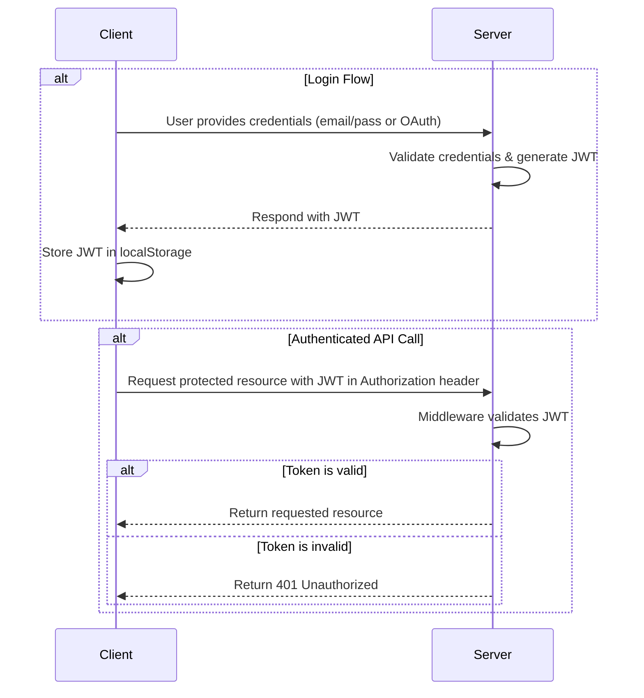

# 🔐 Authentication API

A secure and scalable authentication API built with **Node.js**, **Express**, **MongoDB (Mongoose)**, **JWT**, and **Google OAuth 2.0**.

---

## 🚀 Features

- ✅ User Registration & Login (with JWT)
- 🔐 Password Hashing (using bcrypt)
- 🛡️ JWT Access & Refresh Token Authentication
- 🔄 Token Refresh Endpoint
- 🌐 Google OAuth Login
- 📦 MongoDB Integration with Mongoose
- 🧪 Protected Routes with Middleware

---

## 🛠️ Tech Stack

- **Node.js**
- **Express.js**
- **MongoDB** with **Mongoose**
- **JWT (jsonwebtoken)**
- **bcrypt**
- **Passport.js** + **Google OAuth 2.0**
- **dotenv**

---

## 📁 Project Structure

```
auth-app/
├── server/ (Node.js Backend)
│   ├── controllers/           → Auth logic (register, login, Google OAuth)
│   ├── models/                → Mongoose schemas (User)
│   ├── routes/                → Auth & user-related routes
│   ├── middlewares/           → JWT authentication middleware
│   ├── .env                   → Env variables (JWT, DB URI, OAuth keys)
│   └── server.js              → Express server entry point

```

---

## 🔄 Authentication Flow Diagram




       

### Setup

1.  **Clone the repository:**
    ```bash
    git clone https://github.com/your-username/Authentication_API.git
    cd Authentication_API
    ```

2.  **Configure Environment Variables:**
    Create a `.env` file in the `server` directories.

    **`server/.env`**
    ```env
    MONGO_URI=your_mongodb_connection_string
    JWT_SECRET=your_super_secret_key
    GOOGLE_CLIENT_ID=your_google_client_id
    GOOGLE_CLIENT_SECRET=your_google_client_secret
    ```

